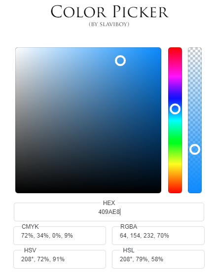
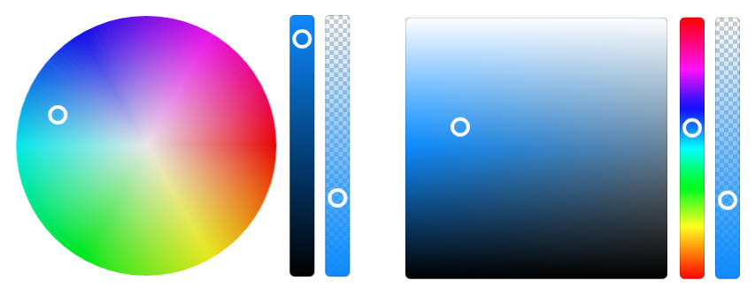

 <p align="center">
    
</p>

## About
The library is made out of the three most popular color picker models. 
* **Corner** - with base color on top-right corner
* **Centered** - with base color on middle-left side
* **Circular** - with hue circle

The first one is the most used one, with base color lying on the right top corner. White(#fff) color is on the left top corner and black(#000) is at the bottom two corners. That way using the HSV(Hue, Saturation, and Value) color model, for the main color window the x coordinate is responsible for S(saturation), and the y coordinate for V(value).

The other two model **centered** and **circular** are not so popular, but are still used today. 
<p align="center">
    
</p>

The second model is **Circular** which instead putting the H(Hue) in seperate color window, it uses the main one and sets the hue around a circle. In the middle a white(#fff) to transparent radial gradien is used, that way the S(saturation) is set by the distance from the center of the circle. In this color picker model additional color window is used for the V(Value).  
Third model is **Centered** which puts the base color at the middle of the left window side and is commonly used with HSL((Hue, Saturation, Lightness).For the main color window the x coordinate is responsible for S(saturation), and the y coordinate for L(lightness).

## Documentation
Each color picker model is fully customizable and is made out of three color windows. Project uses HTML5 canvas objects to visualize the color windows object for the color picker. Three canvases are used to draw the UI and additional three canvas objects
on top of the UI for drawing the selectors. Selectors are the white circle showing current selection for each color window. ColorWindow class is used to creates color window objects for the color picker. You can create your own custom color window and use the available properties.
 
### Set your two canvas elements in your **HTML**
```html
<canvas id="custom-window" width="296" height="296"></canvas>
<canvas id="custom-window-selector" width="296" height="296"></canvas>
```

### Create your custom ColorWindow
You can achive this by creating new custom class and then create new objects. Or you can create your custom object, and set methods from there.

#### Using custom class
```javascript
// create your custom class
class CustomWindow extends ColorWindow {

  constructor(args) {
    super(args);
  }

  onUpdate() {
  }

  onInit() {
  }

  onRedraw() {
  }
}

// create new object
let customWindow = new CustomWindow({
  pickerId: "custom-window",                 // UI canvas id
  selectorId: "custom-window-selector",      // selector canvas id
});
 ```
#### Using object
```javascript
let customWindow = new ColorWindow({
  pickerId: "custom-window",                 // UI canvas id
  selectorId: "custom-window-selector",      // selector canvas id
  onRedraw: function () { },                 // set this method to update the UI canvas
  onUpdate: function () { },                 // set this method to update other windows or text inputs
  onInit: function () { }                    // set this method to init some value
});
``` 
You can check the [custom section](https://github.com/slaviboy/ColorPickerJS/tree/master/ColorPickerJS/custom) with simple example, that demonstrate how to create your own color window. 

### Change your selector style
You can set your custom selector style by overriding the method **redrawSelector(x, y)**
```javascript
customWindow.redrawSelector = function(x, y){
};
```

### Set properties
You set properties using the first object argument of the color window class. There are two properties you can use:
* **centered** 
* **cornerRadius**

```javascript
let customWindow = new ColorWindow({  
  ...   
  
  // to center the selector
  centered: {
    vertically: false,   
    horizontally: false  
  },  

  // canvas corner radiuses
  cornerRadius: {    
    upperLeft: 7,    
    upperRight: 7,   
    lowerLeft: 7,    
    lowerRight: 7   
  }
});
```

